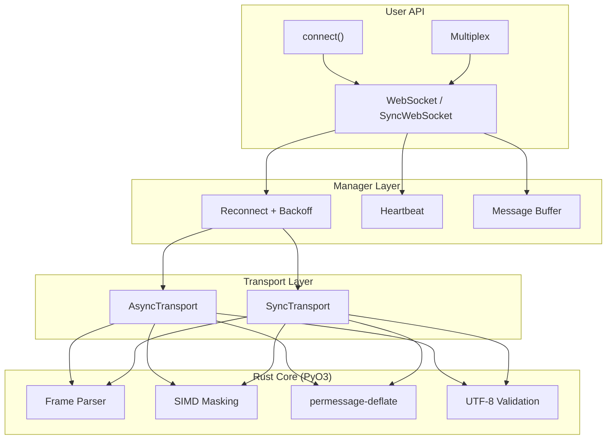

# WSFabric

Production-grade, resilient WebSocket library for Python with Rust-powered performance.

Every existing Python WebSocket library gives you a raw pipe. WSFabric gives you a production-grade client with automatic reconnection, heartbeat management, message buffering, and multiplexing — all backed by a Rust core for maximum performance.

## Quick Start

```python
import asyncio
import wsfabric

async def main():
    async with wsfabric.connect("wss://example.com/ws") as ws:
        await ws.send({"subscribe": "trades"})
        async for message in ws:
            print(message)

asyncio.run(main())
```

## Installation

```bash
pip install wsfabric
```

With optional extras:

```bash
pip install wsfabric[pydantic]   # Typed messages with Pydantic
pip install wsfabric[all]        # All extras
```

## Features

- **Rust-powered core** — SIMD-accelerated frame parsing, masking, UTF-8 validation, and permessage-deflate compression
- **Automatic reconnection** — Exponential backoff with jitter, configurable max attempts
- **Heartbeat management** — WebSocket and application-level ping/pong
- **Message buffering** — Ring buffer with replay-on-reconnect
- **Multiplexing** — Multiple subscriptions over a single connection
- **Typed messages** — Pydantic model validation via `message_type=`
- **Both async and sync** — Native asyncio API and synchronous wrapper
- **Zero runtime dependencies** — Only Python stdlib required

## Usage

### Async (primary API)

```python
from wsfabric import WebSocket

async with WebSocket("wss://stream.example.com/ws", reconnect=True) as ws:
    await ws.send({"subscribe": "trades"})
    async for message in ws:
        print(message)
```

### Sync

```python
from wsfabric import SyncWebSocket

with SyncWebSocket("wss://stream.example.com/ws") as ws:
    ws.send({"subscribe": "trades"})
    msg = ws.recv(timeout=5.0)
    print(msg)
```

### Scalar Config Shorthands

```python
# Simple: just a number
ws = WebSocket("wss://...", heartbeat=20.0, buffer=1000)

# Advanced: full config object
from wsfabric import HeartbeatConfig, BufferConfig
ws = WebSocket("wss://...",
    heartbeat=HeartbeatConfig(interval=20.0, timeout=10.0),
    buffer=BufferConfig(capacity=10_000, overflow_policy="drop_oldest"),
)
```

### Typed Messages

```python
from pydantic import BaseModel
from wsfabric import WebSocket

class Trade(BaseModel):
    symbol: str
    price: float
    quantity: float

async with WebSocket("wss://...", message_type=Trade) as ws:
    async for trade in ws:  # trade: Trade (fully typed)
        print(f"{trade.symbol}: ${trade.price:.2f}")
```

### Multiplexing

```python
from wsfabric import Multiplex

async with Multiplex(
    "wss://stream.binance.com/ws",
    channel_key="stream",
    subscribe_msg=lambda ch: {"method": "SUBSCRIBE", "params": [ch]},
    heartbeat=20.0,
) as mux:
    btc = await mux.subscribe("btcusdt@trade")
    eth = await mux.subscribe("ethusdt@trade")

    async for trade in btc:
        print(f"BTC: {trade}")
```

### Presets

```python
from wsfabric.presets import trading, llm_stream

# Optimized for crypto exchanges
ws = trading("wss://stream.binance.com/ws")

# Optimized for LLM streaming
ws = llm_stream("wss://api.example.com/v1/stream")
```

## Architecture



## Development

```bash
git clone https://github.com/omid/wsfabric && cd wsfabric
uv sync && uv run maturin develop
uv run pytest                    # Run tests
uv run mypy src/ && uv run ruff check .  # Type check + lint
```

## License

MIT
