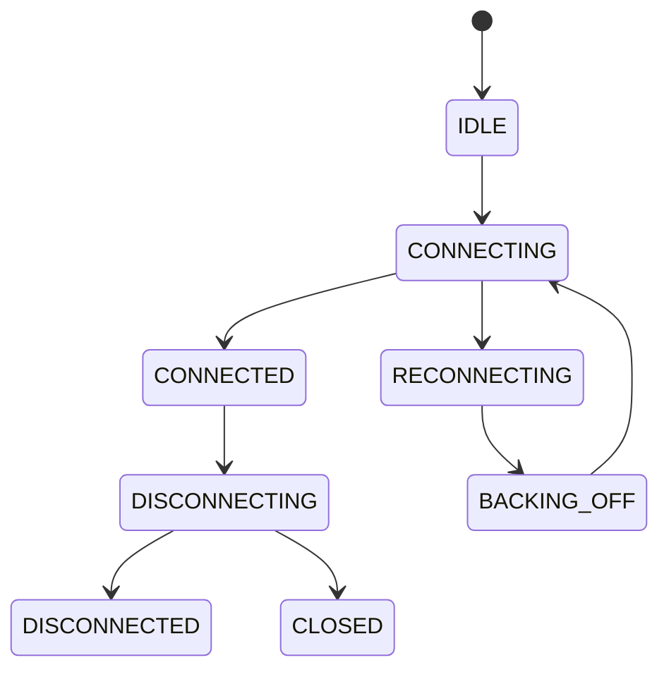

# Basic Concepts

Understanding the core concepts of WSFabric will help you use it effectively.

## Connection Lifecycle

WSFabric manages WebSocket connections through a state machine:



### States

| State | Description |
|-------|-------------|
| `IDLE` | Initial state, no connection attempted |
| `CONNECTING` | TCP + handshake in progress |
| `CONNECTED` | Fully connected, ready for messages |
| `DISCONNECTING` | Close handshake initiated |
| `DISCONNECTED` | Clean disconnect complete |
| `RECONNECTING` | About to reconnect |
| `BACKING_OFF` | Waiting before reconnect attempt |
| `FAILED` | Max retries exhausted or fatal error |
| `CLOSED` | User explicitly closed, no reconnect |

## Event System

WSFabric emits events for every significant lifecycle change:

```python
@ws.on("connecting")      # About to connect
@ws.on("connected")       # Connection established
@ws.on("disconnected")    # Connection lost
@ws.on("reconnecting")    # About to reconnect
@ws.on("reconnected")     # Successfully reconnected
@ws.on("message")         # Message received
@ws.on("error")           # Error occurred
@ws.on("closed")          # Fully closed
```

## Configuration Objects

WSFabric uses frozen dataclasses for configuration:

### BackoffConfig

Controls reconnection timing:

```python
from wsfabric import BackoffConfig

backoff = BackoffConfig(
    base=1.0,        # Initial delay
    multiplier=2.0,  # Exponential multiplier
    cap=60.0,        # Maximum delay
    jitter=True,     # Add randomization
    max_attempts=0,  # 0 = infinite
)
```

### HeartbeatConfig

Controls ping/pong:

```python
from wsfabric import HeartbeatConfig

heartbeat = HeartbeatConfig(
    interval=30.0,  # Send ping every 30s
    timeout=10.0,   # Wait 10s for pong
)
```

### BufferConfig

Controls message buffering:

```python
from wsfabric import BufferConfig

buffer = BufferConfig(
    capacity=1000,
    overflow_policy="drop_oldest",
    enable_dedup=True,
)
```

## Message Flow


## Thread Safety

- **WebSocket**: Async, not thread-safe. Use from a single async context.
- **SyncWebSocket**: Thread-safe. Uses a background thread with event loop.
- **ConnectionPool**: Async, can be shared across tasks but not threads.

## Error Handling

WSFabric distinguishes between retriable and fatal errors:

### Retriable Errors

- Network errors
- Timeout errors
- Server closing connection unexpectedly

### Fatal Errors

- Authentication failures (401, 403)
- Resource not found (404)
- Policy violations (close code 1008)

```python
@ws.on("error")
async def on_error(event):
    if event.fatal:
        print(f"Fatal error: {event.error}")
    else:
        print(f"Retriable error: {event.error}")
```
