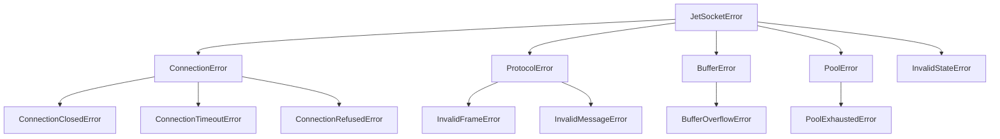

# Exceptions

JetSocket defines a hierarchy of exceptions for precise error handling.

## Exception Hierarchy



## Base Exception

::: jetsocket.exceptions.JetSocketError
    options:
      show_source: false

All JetSocket exceptions inherit from `JetSocketError`:

```python
from jetsocket import JetSocketError

try:
    async with WebSocket(...) as ws:
        ...
except JetSocketError as e:
    print(f"JetSocket error: {e}")
```

## Connection Exceptions

### ConnectionClosedError

Raised when the connection is closed unexpectedly:

```python
from jetsocket import ConnectionClosedError

try:
    await ws.send({"data": "test"})
except ConnectionClosedError as e:
    print(f"Connection closed: code={e.code}, reason={e.reason}")
```

### ConnectionTimeoutError

Raised when a connection or operation times out:

```python
from jetsocket import ConnectionTimeoutError

try:
    await ws.connect(timeout=5.0)
except ConnectionTimeoutError:
    print("Connection timed out")
```

### ConnectionRefusedError

Raised when the server refuses the connection:

```python
from jetsocket import ConnectionRefusedError

try:
    await ws.connect()
except ConnectionRefusedError as e:
    print(f"Connection refused: {e}")
```

## Protocol Exceptions

### InvalidFrameError

Raised when an invalid WebSocket frame is received:

```python
from jetsocket import InvalidFrameError

try:
    async for msg in ws:
        process(msg)
except InvalidFrameError as e:
    print(f"Invalid frame: {e}")
```

### InvalidMessageError

Raised when message parsing fails:

```python
from jetsocket import InvalidMessageError

try:
    msg = await ws.recv()
except InvalidMessageError as e:
    print(f"Invalid message: {e}")
```

## Buffer Exceptions

### BufferOverflowError

Raised when the buffer is full and overflow policy is "error":

```python
from jetsocket import BufferOverflowError, BufferConfig

ws = WebSocket(
    "wss://example.com/ws",
    buffer=BufferConfig(capacity=100, overflow_policy="error"),
)

try:
    async for msg in ws:
        await slow_process(msg)
except BufferOverflowError as e:
    print(f"Buffer overflow: {e.capacity} messages")
```

## Pool Exceptions

### PoolExhaustedError

Raised when all connections in the pool are in use:

```python
from jetsocket import PoolExhaustedError

try:
    async with pool.acquire("/ws", timeout=5.0) as conn:
        ...
except PoolExhaustedError as e:
    print(f"Pool exhausted: max={e.max_connections}")
```

## State Exceptions

### InvalidStateError

Raised when an operation is attempted in an invalid state:

```python
from jetsocket import InvalidStateError

try:
    await ws.send({"data": "test"})  # Not connected
except InvalidStateError as e:
    print(f"Invalid state: {e}")
```

## Best Practices

1. **Catch specific exceptions** when you need specific handling:

```python
try:
    await ws.connect()
except ConnectionTimeoutError:
    # Retry with longer timeout
    await ws.connect(timeout=30.0)
except ConnectionRefusedError:
    # Server is down, alert
    alert_ops("Server unavailable")
```

2. **Catch base exception** for general error handling:

```python
try:
    async with WebSocket(...) as ws:
        async for msg in ws:
            process(msg)
except JetSocketError as e:
    logger.error(f"WebSocket error: {e}")
```
